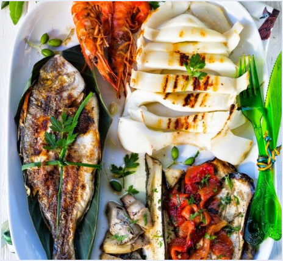

#static website restaurant

DEPLOYING A STATIC WEBSITE INTO AZURE USING AZURE SERVICES

ROLES AND RESPONSIBILITIES:
1.	K.Arun (Website deployment and recording the demo.)
2.	B.Navya (Managing the Documentation and code deployment)
3.	K.Praveen (Data Collection)

PROBLEM STATEMENT

Context: A restaurant is looking to establish a strong online presence by creating a static website that showcases its menu, location, hours of operation, and other essential information. The website needs to be fast, reliable, and scalable, capable of handling a growing customer base. The restaurant management seeks to deploy this website on a cloud platform with minimal infrastructure management and low operational costs.
Challenge: The restaurant’s team lacks the in-house expertise to manage complex servers or infrastructure and is seeking a cloud solution that simplifies the process of hosting and maintaining a static website. Additionally, the website needs to be accessible globally, load quickly, and remain highly available with the ability to automatically scale during peak times (e.g., promotional events, holidays).
PROJECT DESCRIPTION

This project involves deploying a static restaurant website using Microsoft Azure cloud services. The website will showcase the restaurant’s menu, location, and contact information. Azure Blob Storage will host the static files, while Azure CDN ensures fast, global content delivery. Azure DNS will manage custom domain names. The solution is scalable, cost-effective, and requires minimal maintenance, providing the restaurant with a reliable, high-performance online presence

AZURE SERVICES USED

1.	Azure storage account 
2.	Azure static website 
3.	Azure containers
4.	Azure data protection
5.	Azure backup vault
6.	Azure AI services: QnA makers, language service, chatbot.

AZURE STORAGE ACCOUNT:

An Azure Storage Account is a cloud-based service provided by Microsoft Azure that allows users to store and manage various types of data in a secure and scalable manner. It supports different storage services, including Blob Storage for unstructured data (like images and videos), File Storage for file shares, Queue Storage for messaging, and Table Storage for NoSQL data. 

With an Azure Storage Account, users can easily access their data from anywhere, integrate with other Azure services, and benefit from features like redundancy, backup, and security options. It is designed to handle large amounts of data efficiently, making it ideal for applications ranging from simple websites to complex enterprise solutions.

AZURE STATIC WEBSITE:

Azure Static Website is a feature of Azure Storage that enables users to host static web applications directly from a storage account. It allows developers to serve HTML, CSS, JavaScript, and other static files without the need for a backend server. This service is ideal for hosting personal blogs, portfolios, documentation, or any site that doesn't require dynamic content generation.

With Azure Static Website, users benefit from high availability, scalability, and global distribution through Azure's Content Delivery Network (CDN). It also supports custom domain names and provides secure access via HTTPS. The setup is straightforward, making it easy to deploy and manage static sites efficiently while taking advantage of Azure's robust infrastructure.

AZURE CONTAINERS:

Azure Containers are a service offered by Microsoft Azure that allows users to deploy and manage containerized applications in the cloud. Containers are lightweight, portable units that package an application and its dependencies, ensuring consistent performance across different environments. Azure provides several options for working with containers, including Azure Kubernetes Service (AKS) for orchestrating and managing container clusters, and Azure Container Instances (ACI) for running containers without the need for complex orchestration.

Using Azure Containers, developers can easily scale applications, improve resource utilization, and enhance deployment speed. This service supports various container images and integrates seamlessly with other Azure services, making it ideal for modern cloud-native applications and microservices architectures.

AZURE DATA PROTECTION:

Azure Data Protection Service is a solution from Microsoft Azure designed to safeguard data across various environments. It includes features like Azure Backup for secure data backup, Azure Site Recovery for disaster recovery, advanced security measures to protect against threats, and tools to ensure compliance with regulations. Overall, it helps organizations keep their data safe, recoverable, and compliant.

AZURE BACKUP VAULT:

Azure Backup Vault is a storage solution in Microsoft Azure that securely stores backup data. It allows centralized management of backups for Azure resources and on-premises servers. Key features include built-in security with data encryption, customizable retention policies for compliance, and cost management options. Overall, it helps ensure your backup data is organized and protected.

AZURE AI SERVICES:

Azure AI services provide a comprehensive suite of tools and APIs that enable developers to build intelligent applications. These services include Azure Machine Learning for creating and deploying machine learning models, Cognitive Services for integrating features like image and speech recognition, Azure Bot Services for developing chatbots, and Azure Cognitive Search for enhancing search capabilities with AI. Together, they empower businesses to leverage artificial intelligence to improve user experiences and streamline operations.

SOURCE CODE

<!DOCTYPE html>
<html>
  <head>
    <link rel="stylesheet" href="https://stackpath.bootstrapcdn.com/bootstrap/4.5.2/css/bootstrap.min.css" integrity="sha384-JcKb8q3iqJ61gNV9KGb8thSsNjpSL0n8PARn9HuZOnIxN0hoP+VmmDGMN5t9UJ0Z" crossorigin="anonymous"/>
    <link rel="stylesheet" href="./index.css" />
    
    
    
    
  </head>
  <body>
    <nav class="navbar navbar-expand-lg navbar-light bg-white fixed-top">
      

        
        <button class="navbar-toggler" type="button" data-toggle="collapse" data-target="#navbarNavAltMarkup" aria-controls="navbarNavAltMarkup" aria-expanded="false" aria-label="Toggle navigation">
          `
        </button>
        

          

            <a class="nav-link active" id="navItem1" href="#wcuSection">
              Why Choose Us?
              (current)
            </a>
            <a class="nav-link" href="#exploreMenuSection" id="navItem2">Explore Menu</a>
            <a class="nav-link" href="#deliveryPaymentSection" id="navItem3">Delivery & Payment</a>
            <a class="nav-link" href="#followUsSection" id="navItem4">Follow Us</a>
          

        

      

    </nav>
    

      

        <h1 class="banner-heading mb-3">Get Delicious Food Anytime</h1>
        
Eat Smart & Healthy

        <button class="custom-outline-button">
          <a class="custom-outline-button" href="#exploreMenuSection" id="navItem2">View Menu</a>
        </button>
        <button class="custom-outline-button">
          <a class="custom-outline-button" href="#deliveryPaymentSection" id="navItem3" >Order Now</a>
        </button>
      

    

    

      

        

          

            <h1 class="wcu-section-heading">Why Choose Us?</h1>
            

              We use both original recipes and classic versions of famous food
              items.
            

          

          

            

              
              <h1 class="wcu-card-title mt-3">Food Service</h1>
              

                Experience fine dining at the comfort of your home. All our
                orders are carefully packed and arranged to give you the nothing
                less than perfect.
              

            

          

          

            

              
              <h1 class="wcu-card-title mt-3">Fresh Food</h1>
              

                The Fresh Food group provides fresh-cut fruits and vegetables
                directly picked from our partner farms and farm houses so that
                you always get them tree to plate.
              

            

          

          

            

              
              <h1 class="wcu-card-title mt-3">Best Offers</h1>
              

                Food Coupons & Offers upto
                50% OFF
                and Exclusive Promo Codes on All Online Food Orders.
              

            

          

        

      

    

    

      

        

          

            <h1 class="menu-section-heading">Explore Menu</h1>
          

          

            

              
              <h1 class="menu-card-title">Non-Veg Starters</h1>
              <a href="" class="menu-item-link">
                View All
                <svg width="16px" height="16px" viewBox="0 0 16 16" class="bi bi-arrow-right-short" fill="#d0b200" xmlns="http://www.w3.org/2000/svg">
                  <path
                    fill-rule="evenodd"
                    d="M4 8a.5.5 0 0 1 .5-.5h5.793L8.146 5.354a.5.5 0 1 1 .708-.708l3 3a.5.5 0 0 1 0 .708l-3 3a.5.5 0 0 1-.708-.708L10.293 8.5H4.5A.5.5 0 0 1 4 8z"
                  />
                </svg>
              </a>
            

          

          

            

              
              <h1 class="menu-card-title">Veg Starters</h1>
              <a href="" class="menu-item-link">
                View All
                <svg width="16px" height="16px" viewBox="0 0 16 16" class="bi bi-arrow-right" fill="#d0b200" xmlns="http://www.w3.org/2000/svg">
                  <path
                    fill-rule="evenodd"
                    d="M4 8a.5.5 0 0 1 .5-.5h5.793L8.146 5.354a.5.5 0 1 1 .708-.708l3 3a.5.5 0 0 1 0 .708l-3 3a.5.5 0 0 1-.708-.708L10.293 8.5H4.5A.5.5 0 0 1 4 8z"
                  />
                </svg>
              </a>
            

          

          

            

              
              <h1 class="menu-card-title">Soups</h1>
              <a href="" class="menu-item-link">
                View All
                <svg width="16px" height="16px" viewBox="0 0 16 16" class="bi bi-arrow-right" fill="#d0b200" xmlns="http://www.w3.org/2000/svg">
                  <path
                    fill-rule="evenodd"
                    d="M4 8a.5.5 0 0 1 .5-.5h5.793L8.146 5.354a.5.5 0 1 1 .708-.708l3 3a.5.5 0 0 1 0 .708l-3 3a.5.5 0 0 1-.708-.708L10.293 8.5H4.5A.5.5 0 0 1 4 8z"
                  />
                </svg>
              </a>
            

          

          

            

              
              <h1 class="menu-card-title">Fish & Sea food</h1>
              <a href="" class="menu-item-link">
                View All
                <svg width="16px" height="16px" viewBox="0 0 16 16" class="bi bi-arrow-right" fill="#d0b200" xmlns="http://www.w3.org/2000/svg">
                  <path
                    fill-rule="evenodd"
                    d="M4 8a.5.5 0 0 1 .5-.5h5.793L8.146 5.354a.5.5 0 1 1 .708-.708l3 3a.5.5 0 0 1 0 .708l-3 3a.5.5 0 0 1-.708-.708L10.293 8.5H4.5A.5.5 0 0 1 4 8z"
                  />
                </svg>
              </a>
            

          

          

            

              
              <h1 class="menu-card-title">Main Course</h1>
              <a href="" class="menu-item-link">
                View All
                <svg width="16px" height="16px" viewBox="0 0 16 16" class="bi bi-arrow-right" fill="#d0b200" xmlns="http://www.w3.org/2000/svg">
                  <path
                    fill-rule="evenodd"
                    d="M4 8a.5.5 0 0 1 .5-.5h5.793L8.146 5.354a.5.5 0 1 1 .708-.708l3 3a.5.5 0 0 1 0 .708l-3 3a.5.5 0 0 1-.708-.708L10.293 8.5H4.5A.5.5 0 0 1 4 8z"
                  />
                </svg>
              </a>
            

          

          

            

              
              <h1 class="menu-card-title">Noodles</h1>
              <a href="" class="menu-item-link">
                View All
                <svg width="16px" height="16px" viewBox="0 0 16 16" class="bi bi-arrow-right" fill="#d0b200" xmlns="http://www.w3.org/2000/svg">
                  <path
                    fill-rule="evenodd"
                    d="M4 8a.5.5 0 0 1 .5-.5h5.793L8.146 5.354a.5.5 0 1 1 .708-.708l3 3a.5.5 0 0 1 0 .708l-3 3a.5.5 0 0 1-.708-.708L10.293 8.5H4.5A.5.5 0 0 1 4 8z"
                  />
                </svg>
              </a>
            

          

          

            

              
              <h1 class="menu-card-title">Salads</h1>
              <a href="" class="menu-item-link">
                View All
                <svg width="16px" height="16px" viewBox="0 0 16 16" class="bi bi-arrow-right" fill="#d0b200" xmlns="http://www.w3.org/2000/svg">
                  <path
                    fill-rule="evenodd"
                    d="M4 8a.5.5 0 0 1 .5-.5h5.793L8.146 5.354a.5.5 0 1 1 .708-.708l3 3a.5.5 0 0 1 0 .708l-3 3a.5.5 0 0 1-.708-.708L10.293 8.5H4.5A.5.5 0 0 1 4 8z"
                  />
                </svg>
              </a>
            

          

          

            

              
              <h1 class="menu-card-title">Desserts</h1>
              <a href="" class="menu-item-link">
                View All
                <svg width="16px" height="16px" viewBox="0 0 16 16" class="bi bi-arrow-right" fill="#d0b200" xmlns="http://www.w3.org/2000/svg">
                  <path
                    fill-rule="evenodd"
                    d="M4 8a.5.5 0 0 1 .5-.5h5.793L8.146 5.354a.5.5 0 1 1 .708-.708l3 3a.5.5 0 0 1 0 .708l-3 3a.5.5 0 0 1-.708-.708L10.293 8.5H4.5A.5.5 0 0 1 4 8z"
                  />
                </svg>
              </a>
            

          

        

      

    

    

      

        

          

            

              
            

          

          

            <h1 class="healthy-food-section-heading">
              Fresh, Healthy, Organic, Delicious Fruits
            </h1>
            

              Say no to harmful chemicals and go fully organic with our range of
              fresh fruits and veggies. Pamper your body and your senses with
              the true and unadulterated gifts from mother nature. with the true
              and unadulterated gifts from mother nature.
            

            <button class="custom-button">Watch Video</button>
          

        

      

    

    

      

        

          

            

              
            

          

          

            <h1 class="delivery-and-payment-section-heading">
              Delivery and Payment
            </h1>
            

              Enjoy hassle-free payment with the plenitude of payment options
              available for you. Get live tracking and locate your food on a
              live map. It's quite a sight to see your food arrive to your door.
              Plus, you get a 5% discount on every order every time you pay
              online.
            

            <button class="custom-button">Order Now</button>
            

              
              
              
              
            

          

        

      

    

    

      

        

          

            <h1 class="thanking-customers-section-heading">
              Thank you for being a valuable customer to us.
            </h1>
            

              We have a surprise gift for you
            

            

              
            

            

              <button type="button" class="custom-button" data-toggle="modal" data-target="#exampleModal">
                Redeem Gift
              </button>
              

                

                  

                    

                      <h5 class="modal-title thanking-customers-section-modal-title" id="exampleModalLabel">
                        Gift Voucher
                      </h5>
                      <button type="button" class="close" data-dismiss="modal" aria-label="Close">
                        &times;
                      </button>
                    

                    

                      
                    

                    

                      <button type="button" class="btn btn-secondary" data-dismiss="modal">
                        Close
                      </button>
                    

                  

                

              

            

          

          

            
          

        

      

    

    

      

        

          

            <h1 class="follow-us-section-heading">Follow Us</h1>
          

          

            

              

                <i class="fab fa-twitter icon"></i>
              

              

                <i class="fab fa-instagram icon"></i>
              

              

                <i class="fab fa-facebook icon"></i>
              

            

          

        

      

    

    

      

        

          

            
            <h1 class="footer-section-mail-id">orderfood@foodmunch.com</h1>
            

              123 Ayur Vigyan Nagar, New Delhi, India.
            

          

        

      

    

  </body>
</html>

CONCLUSION

Deploying a static restaurant website using Azure Services offers an efficient, scalable, and cost-effective solution for establishing a robust online presence. By leveraging Azure Blob Storage for hosting, Azure CDN for fast, global content delivery, and Azure DNS for domain management, the website achieves high performance, reliability, and accessibility. This approach minimizes the need for ongoing infrastructure maintenance while ensuring the website can handle increased traffic and provide a seamless user experience. Overall, Azure provides a flexible and secure platform, allowing the restaurant to focus on growing its business while ensuring an optimal digital presence.

